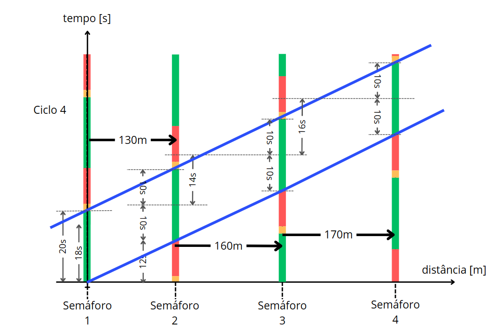

# ONDA VERDE

Este projeto tem como objetivo modelar, utilizando a ferramenta UPPAAL, um sistema de semáforos que permita a um motorista percorrer um trajeto de forma otimizada, passando por no máximo um semáforo vermelho.

## Etapa 1: Modelagem dos Autômatos Temporizados

Nesta etapa inicial do projeto, serão criados os modelos de autômatos temporizados que definem o comportamento dos 4 semáforos e do motorista. Abaixo estão os dados relevantes para a modelagem:

- **Distância do posto ao 1º semáforo:** 1.200m
- **Distância do 1º ao 2º semáforo:** 130m
- **Distância do 2º ao 3º semáforo:** 160m
- **Distância do 3º ao 4º semáforo:** 170m
- **Distância do 4º semáforo ao Rota:** 90m
- **Distância total:** 1.750m
- **Velocidade média de deslocamento:** 40 km/h

com base nos tempos de trajetos e considerando a velocidade média da via como 40 km/h (11 m/s), pode-se considerar que o tempo de trajeto médio conforme a tela a seguir.

| Trajeto    | Distância (m) | Tempo (s)|
|------------|---------------|----------|
|1º Semáforo | 1200          |109       |
|2º Semáforo | 130           |12        |        
|3º Semáforo | 160           |14        |        
|4º Semáforo | 170           |16        |   
|Rota        | 90            |8         |
|Total       | 1750          |159       |
     
Para garantir que o motorista chegue ao destino parando em no máximo um semáforo, será necessário sincronizar os semáforos de forma inteligente, considerando as distâncias entre eles e a velocidade média de deslocamento. A figura abaixo exemplifica o conceito de onda verde, que têm como objetivo minimizar o tempo de espera e por consequência o tempo de trajeto efetivo.

### Projetando a onda verde

O primeiro passo é a definição dos tempos dos semáforos, inicialmente pode-se propô o seguinte esquema de cores de sinalização no trajeto analisado:

Com esse esquema pode-se traçar uma rotina de sinalização das vias considerando o tempo médio para conclusão de cada trecho do percurso. Então o diagrama temporal será analisado conforme as necessidades da via e dos usuários.

Para exemplificar o problema, vamos considerar que um usuário qualquer denominado senhor K, deseja desloca-se do ponto inicial (Posto) até o seu destino final (Rota) trafegando a uma velocidade média ($V_{med}$). O senhor K deseja concluir o trajeto no menor tempo possível que o permita parar no máximo uma única vez em uma das sinalizações controladas dispostas ao longo das vias que contempla o percurso.

Senhor K pode iniciar seu trajeto a qualquer momento, independente do estado atual do sistema. Se ele partir a tem um instante $t_0$ ele chegará ao semáforo em um instante $t_1=120$ segundos. Durante o trajeto do ponto inicial até o 1º semáforo, terão ocorridos cerca de 3,6 ($\frac{t_1 - t_0}{T_{ciclo}}$) ciclos do sistema. Então o senhor K estará diante de qualquer estado que é passível de ocorrer durante os 40 % restantes do ciclo em que chegou. Alguns casos podem ser analisados:
- Se ele partiu no exato momento em que o próximo sinal abriu, ele chegará no semáforo à 60% do ciclo, ou seja, o contador de S1 estará indicando 18 segundos. E conseguirá passar no sinal verde nos segundos restante.
- Se ele partir a qualquer momento após a abertura de S1, em que:
    - $t_0 \in [0, 2)$ sinal verde
    - $t_0 \in [2, 4)$ sinal amarelo
    - $t_0 \in [4, 12)$ sinal vermelho
    - $t_0 \in [12, 22)$ sinal verde (repete o ciclo)

A figura acima é uma representação gráfica do pressuposto analisado. No pior caso, o senhor K arbitrariamente deixa o ponto de partida e segue conduzindo seu veículo até que eventualmente se depara com o primeiro semáforo fechado. Daí, para garantir que esta será a única vez que o sinal estará fechado para o senhor K, os semáforos seguintes precisam estar sincronizados de tal sorte que o restante do trajeto estará livre de paradas.

O esquema permite no máximo uma única parada na via analisada está exibido na figura a seguir, e consiste da sincronização dos semáforos de tal modo a permitir que uma vez dentro da onda verde, os usuários possam conduzir de maneira fluída na velocidade indicada para a via.

## Verificação

A verificação é uma ferramenta essencial do UPPAAL, permitindo verificar se certas propriedades do sistema (*Reachability, Safety and Liveness*) são mantidas pela exploração *on-the-fly* do sistema em seu espaço de estados.

Para utilizar essa ferramenta, basta acessar o menu de opções do UPPAAL e selecionar a aba chamada "Verifier". Nesse menu, é possível escrever as queries (requisitos do sistema) para verificar se o modelo atende às especificações do projeto. O UPPAAL utiliza uma versão simplificada do Timed Computation Tree Logic (TCTL) para essa finalidade.

### A Linguagem de Busca (The Query Language)

A linguagem de busca consiste em *State formulae* e *Path formulae* (propriedades de estado e de caminho). Essa linguagem é formalmente expressa e bem definida, sendo legível tanto por humanos quanto por máquinas.

**State Formulae**:
Uma State formula é uma expressão que pode ser avaliada para um estado sem considerar o comportamento do modelo. Por exemplo, pode ser uma expressão simples como `i == 7`, que é verdadeira em qualquer estado onde `i` seja igual a 7. Também é possível testar se um processo P está em uma localização I usando a expressão na forma `P.I`.

**Path Formulae**:
Quantifica em um caminho ou *trace* de um modelo e é classificado como alcançável, seguro ou de liveness.

**Estados**:
São definidos como uma tupla (L, v), onde L é um vetor de localização e v é a função de avaliação que mapeia uma variável inteira e *clocks* para seus respectivos valores.

**Tipos de Queries**:
- Propriedades de alcançabilidade: Verifica se uma condição específica é mantida em um determinado estado ou em alguns comportamentos potenciais do modelo.
- Propriedades de segurança: Garante que uma condição específica é mantida em todos os estados de um caminho de execução.
- Propriedades de liveness: Garante que uma determinada condição será eventualmente verificada em algum momento.
- Propriedades de deadlock: Verifica se um deadlock é possível ou não no modelo.

**Tipos no UPPAAL**:
- E - Existe um caminho
- A - Para todos os caminhos
- [] - Todos os estados em um caminho
- <> - Algum estado em um caminho

Algumas combinações também são suportadas, como:
A[] <expressão>
E<> <expressão>
E[] <expressão>
A<> <expressão>
<expressão> --> <expressão>

**Verificação de Alcançabilidade**:
Verifica se algum estado é alcançável a partir do estado inicial.
- `E<> p`: É possível alcançar um estado onde p é satisfeito.
- p é verdadeira se pelo menos um estado é alcançável.
